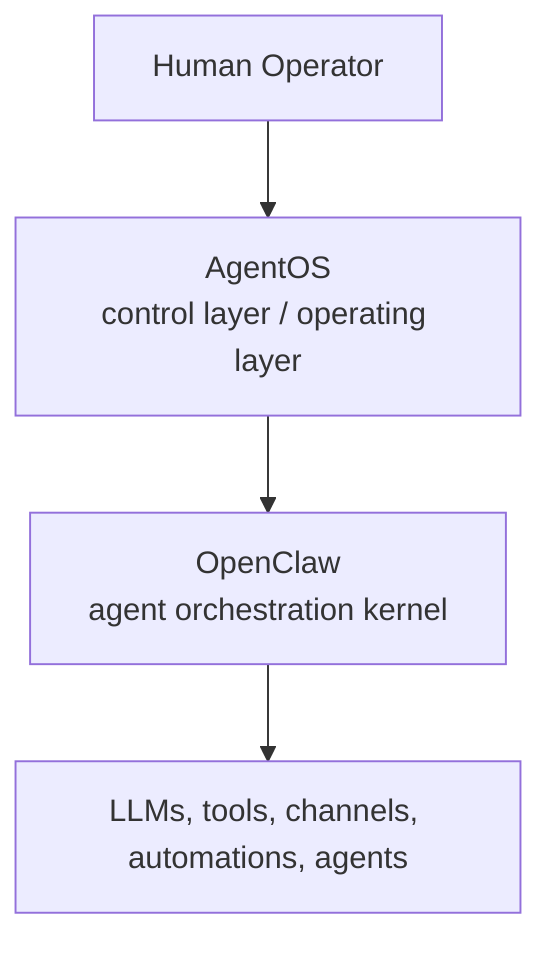
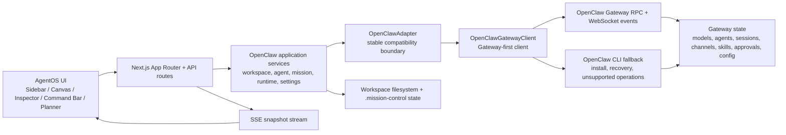

<div align="center">
  

# AgentOS | Control Plane

**Human operating layer for coordinating AI agents, projects, and companies from a single workspace.**

Built on top of OpenClaw, the agent orchestration kernel.

<p>
  <a href="https://sapienx.app/agentos"><strong>Website</strong></a>
  ·
  <a href="https://www.youtube.com/watch?v=ujz-4bYDjdY"><strong>Watch Demo</strong></a>
  ·
  <a href="#try-agentos-in-5-minutes"><strong>Try in 5 minutes</strong></a>
  ·
  <a href="#why-agentos"><strong>Why AgentOS</strong></a>
  ·
  <a href="#architecture"><strong>Architecture</strong></a>
  ·
  <a href="#product-highlights"><strong>Highlights</strong></a>
  ·
  <a href="#setup-and-development"><strong>Setup</strong></a>
  ·
  <a href="#roadmap"><strong>Roadmap</strong></a>
</p>

<p align="center">
  <a href="https://nextjs.org" target="_blank" rel="noreferrer" title="Next.js" style="text-decoration:none; display:inline-flex; align-items:center; gap:4px; margin:0 8px 5px 0; font-size:0.86rem; line-height:1;">
    
    <strong>Next.js</strong>
  </a>
  <a href="https://react.dev" target="_blank" rel="noreferrer" title="React" style="text-decoration:none; display:inline-flex; align-items:center; gap:4px; margin:0 8px 5px 0; font-size:0.86rem; line-height:1;">
    
    <strong>React</strong>
  </a>
  <a href="https://www.typescriptlang.org" target="_blank" rel="noreferrer" title="TypeScript" style="text-decoration:none; display:inline-flex; align-items:center; gap:4px; margin:0 8px 5px 0; font-size:0.86rem; line-height:1;">
    
    <strong>TypeScript</strong>
  </a>
  <a href="https://github.com/openclaw/openclaw" target="_blank" rel="noreferrer" title="OpenClaw" style="text-decoration:none; display:inline-flex; align-items:center; gap:4px; margin:0 8px 5px 0; font-size:0.86rem; line-height:1;">
    
  </a>
  <a href="https://pnpm.io" target="_blank" rel="noreferrer" title="pnpm" style="text-decoration:none; display:inline-flex; align-items:center; gap:4px; margin:0 8px 5px 0; font-size:0.86rem; line-height:1;">
    
    <strong>pnpm</strong>
  </a>
</p>

</div>

## Try AgentOS in 5 minutes

Install AgentOS:

```bash
curl -fsSL https://raw.githubusercontent.com/SapienXai/AgentOS/main/install.sh | bash
```

Or use a package manager:

```bash
pnpm add -g @sapienx/agentos
```

Open the UI:

```bash
agentos start --open
```

Verify the local runtime:

```bash
agentos status
agentos doctor
```

First thing to try:

- Open the AgentOS UI.
- Check the OpenClaw onboarding state.
- Create or inspect a workspace.
- Create an agent or use the guided workspace flow.
- Dispatch a mission.
- Inspect the runtime output or transcript.

If OpenClaw is already installed, AgentOS connects to the live control plane and shows the current gateway, models, agents, and runtimes.
If OpenClaw is missing or not ready yet, AgentOS opens in an explicit unavailable/onboarding state instead of showing a fake live state.

## Product Highlights

The screenshots below show the current product flow in the order a new visitor is most likely to explore it.

<table>
  <tr>
    <td valign="top" width="50%">
      
      <strong>Launchpad</strong><br />
      Guided onboarding for OpenClaw, models, and the first workspace.
    </td>
    <td valign="top" width="50%">
      
      <strong>Control Plane</strong><br />
      Live graph, task flow, and inspector visibility in one place.
    </td>
  </tr>
  <tr>
    <td valign="top" width="50%">
      
      <strong>Agent Builder</strong><br />
      Create agents from scratch, presets, or imports.
    </td>
    <td valign="top" width="50%">
      
      <strong>Agent Chat</strong><br />
      Talk to agents directly and turn intent into action.
    </td>
  </tr>
  <tr>
    <td valign="top" width="50%">
      
      <strong>Add Models</strong><br />
      Connect providers and discover models without leaving AgentOS.
    </td>
    <td valign="top" width="50%">
      
      <strong>Workspace Wizard</strong><br />
      Shape a workspace from one prompt and a guided flow.
    </td>
  </tr>
  <tr>
    <td colspan="2" valign="top">
      
      <strong>Workspace Surfaces</strong><br />
      Connect Telegram, Discord, Slack, and more to every workspace.
    </td>
  </tr>
</table>

## Why AgentOS

As AI agents become cheaper to run, the bottleneck shifts from raw orchestration to human control.
Someone still has to decide what matters, inspect active work, route missions, review outputs, and keep multiple projects legible.

Most agent systems expose runtimes, sessions, and CLI primitives.
AgentOS adds the missing operating layer above them: a control-plane interface for humans coordinating teams of agents across real workspaces.

This repository contains the current AgentOS control plane: a Next.js application that sits above OpenClaw and turns live agent state into an operator-facing system for planning, execution, inspection, and workspace management.

## The Problem It Solves

Running one agent is not the hard part.
Operating many agents across many projects is.

AgentOS is built for that coordination problem:

- A human operator needs one place to see workspaces, agents, models, runtimes, and health.
- Missions should map to real project folders, not ephemeral chat threads.
- Runtime output should be inspectable after the fact, including created files and transcript history.
- Agent teams need structure: presets, policies, memory, workspace scaffolds, and repeatable operating conventions.
- As the "one-person company" model emerges, the human needs a control layer, not just an orchestration engine.

## Quick Start

Use the packaged launcher:

```bash
pnpm add -g @sapienx/agentos
agentos start --open
agentos doctor
```

Run the app locally from this repository:

```bash
pnpm install
pnpm dev
```

If OpenClaw is not ready yet, AgentOS starts in an explicit onboarding or fallback path instead of pretending a live control plane exists.

## Architecture



### Layer Responsibilities

| Layer | Responsibility |
| --- | --- |
| Human operator | Sets direction, reviews work, approves risky actions, and steers the system |
| AgentOS | Presents topology, planning, inspection, workspace bootstrap, settings, and mission dispatch |
| OpenClaw | Owns agent orchestration, gateway state, models, sessions, channels, and execution surfaces |
| LLMs and tools | Perform the underlying reasoning and tool-backed work |

### Control Plane Shape



## AgentOS and OpenClaw

OpenClaw is the kernel.
It handles the underlying agent runtime, CLI, gateway, models, sessions, automations, and execution primitives.

AgentOS is the operating layer above it.
It does not replace OpenClaw.
Instead, it reads live OpenClaw state, normalizes it into a control-plane snapshot, and gives the human operator a coherent surface for acting on that state.

In practice, that means:

- OpenClaw remains the source of truth for gateway state, models, agents, sessions, channels, skills, approvals, config, and runtime execution.
- AgentOS uses native OpenClaw Gateway RPC first for supported operations.
- AgentOS keeps the OpenClaw CLI as fallback for install, recovery, gateway process control, and unsupported or older Gateway methods.
- AgentOS translates UI actions into OpenClaw Gateway calls, documented CLI fallbacks, and real filesystem changes.
- AgentOS is intentionally not a mock dashboard; it is a control surface over live operational state.

## Compatibility / Tested Runtime

AgentOS is Gateway-first on top of OpenClaw. Use `agentos doctor` and the in-app diagnostics panel to confirm the installed OpenClaw version, Gateway protocol range, native auth state, model readiness, and fallback activity before dispatching real missions.

The 0.5.5 release expects Node.js 20.9 or newer and an OpenClaw Gateway whose protocol overlaps the supported range reported by diagnostics. If compatibility is degraded, update OpenClaw, repair Gateway token/device access, restart the Gateway, and re-run `agentos doctor`.

## How The System Works

1. AgentOS detects the OpenClaw version, Gateway protocol, auth mode, and advertised RPC capabilities.
2. AgentOS reads live OpenClaw surfaces through Gateway-first RPC calls, with CLI fallback when the Gateway is unavailable, scope-limited, malformed, or does not support a method yet.
3. The application layer normalizes gateway state, sessions, local transcripts, workspace metadata, and AgentOS sidecar state into a single `MissionControlSnapshot`.
4. The UI renders that snapshot as a control-plane surface with a topology canvas, sidebar, inspector, and command bar.
5. Operator actions such as mission dispatch, workspace creation, agent updates, planner deploys, gateway changes, or file reveal calls pass through the OpenClaw adapter boundary before touching Gateway RPC, CLI fallback, or local filesystem state.
6. Gateway WebSocket events and Server-Sent Events keep runtime and task views close to live OpenClaw activity without replacing existing snapshot rendering.

## Key Features

- Live topology canvas for real workspace -> agent -> runtime relationships.
- Gateway-first mission dispatch that targets real OpenClaw agents and supports thinking levels.
- Transcript-backed runtime inspection, including final output, warnings, token usage, and created files.
- Persistent Gateway event bridge for chat, tool, log, session, and approval activity where supported by OpenClaw.
- File reveal actions from the inspector for artifacts written to the local filesystem.
- Workspace wizard with basic create flow and advanced planner mode, including source modes (`empty`, `clone`, `existing`), templates, team presets, model profiles, and kickoff missions.
- Structured workspace scaffolding with `AGENTS.md`, `SOUL.md`, `IDENTITY.md`, `TOOLS.md`, `HEARTBEAT.md`, `MEMORY.md`, `docs/`, `memory/`, `deliverables/`, `skills/`, and `.openclaw/project-shell/`.
- Agent creation and editing with policy presets (`worker`, `setup`, `browser`, `monitoring`, `custom`) plus heartbeat, file-access, install-scope, and network controls.
- Guided workspace planner that models company, product, workspace, team, operations, and deploy decisions inside the workspace wizard.
- Planner deploy flows that can turn a plan into a live workspace, agent team, automations, channels, and first missions.
- OpenClaw onboarding, model setup, Gateway diagnostics, native auth repair, reset, and update flows directly from the UI.
- Capability diagnostics for Gateway protocol, auth mode, supported RPC methods, config schema/patch support, channel support, skills support, approvals support, and update support.
- Gateway-first config reads and patch/apply writes with base-hash concurrency protection and redacted-secret safety.
- Configurable gateway endpoint and default workspace root from settings.
- Explicit fallback mode when OpenClaw is unavailable, rather than pretending live control exists.

## What works today / What is coming next

### What works today

- Local AgentOS control plane built with Next.js.
- OpenClaw-aware onboarding and fallback state.
- Workspace overview and live control-plane snapshot.
- Agent creation and editing with presets and policies.
- Workspace creation and guided workspace wizard.
- Gateway-first mission dispatch to OpenClaw-backed agents.
- Runtime and transcript inspection.
- Gateway event bridge for supported OpenClaw chat, tool, log, session, and approval events.
- Gateway diagnostics, capability matrix, native auth repair, and control actions.
- Local-first settings for gateway endpoint and workspace root.
- Install paths through the release installer and package manager.

### What is coming next

- Deeper Telegram and Discord operation jobs.
- More complete approval history and audit trails.
- Stronger recurring workflow and job management.
- Richer model and provider setup guidance.
- More workspace and agent preset examples.
- Better remote or multi-host OpenClaw management.
- More durable analytics and historical runtime views.

## UI Surfaces

| Surface | Purpose |
| --- | --- |
| `MissionSidebar` | Gateway diagnostics, workspace navigation, models, agents, and workspace or agent CRUD |
| `MissionCanvas` | Visual topology for workspaces, agents, and runtimes with selection and mission feedback |
| `InspectorPanel` | Detailed inspection of selected entities, transcript output, raw payloads, and created files |
| `CommandBar` | Mission composition, agent targeting, thinking level selection, refresh, and quick suggestions |
| `WorkspaceWizardDialog` | Handle both basic workspace creation and advanced planner-driven workspace design and deploy |
| `OpenClawOnboarding` | Detect, install, start, verify OpenClaw, and guide model readiness when the local machine is not ready |
| `ResetDialog` | Preview AgentOS reset or full uninstall actions and stream execution progress and logs |

## Repository Map (Key Files)

```text
app/
  api/
    agents/
    diagnostics/
    files/reveal/
    gateway/control/
    mission/
    onboarding/
    onboarding/models/
    planner/
    reset/
    runtimes/[runtimeId]/
    settings/
    snapshot/
    stream/
    system/open-terminal/
    update/
    workspaces/
  layout.tsx
  page.tsx

components/mission-control/
  canvas.tsx
  command-bar.tsx
  create-agent-dialog.tsx
  inspector-panel.tsx
  mission-control-shell.tsx
  openclaw-onboarding.tsx
  operation-progress.tsx
  reset-dialog.tsx
  sidebar.tsx
  nodes/
  workspace-wizard/
    workspace-wizard-dialog.tsx
    workspace-wizard-draft-pane.tsx
    workspace-wizard-header.tsx
    wizard-composer.tsx
    wizard-message-list.tsx
    wizard-suggestion-chips.tsx

hooks/
  use-mission-control-data.ts
  use-workspace-wizard-draft.ts

lib/openclaw/
  agent-heartbeat.ts
  agent-presets.ts
  cli.ts
  fallback.ts
  operation-progress.ts
  planner.ts
  planner-core.ts
  planner-presenters.ts
  presenters.ts
  readiness.ts
  reset.ts
  service.ts
  types.ts
  adapter/
  application/
  client/
  domains/
  state/
  workspace-presets.ts
  workspace-wizard-inference.ts
  workspace-wizard-mappers.ts

packages/agentos/
  bin/
  scripts/
  README.md
  package.json
```

This is a representative map of the current control-plane code, not an exhaustive file listing.
Many internal files still use legacy `mission-control` naming.

## Setup And Development

### Prerequisites

- A recent Node.js runtime
- `pnpm`
- OpenClaw installed locally and reachable on `PATH`

If OpenClaw is installed in a non-standard location:

```bash
export OPENCLAW_BIN=/absolute/path/to/openclaw
```

### Install

GitHub Release installer:

macOS / Linux:

```bash
curl -fsSL https://raw.githubusercontent.com/SapienXai/AgentOS/main/install.sh | bash
agentos start --open
agentos stop
agentos doctor
```

Windows PowerShell:

```powershell
iwr https://raw.githubusercontent.com/SapienXai/AgentOS/main/install.ps1 | iex
agentos start --open
agentos stop
agentos doctor
```

Install a specific published version:

macOS / Linux:

```bash
curl -fsSL https://raw.githubusercontent.com/SapienXai/AgentOS/main/install.sh | AGENTOS_VERSION=0.5.5 bash
```

Windows PowerShell:

```powershell
$env:AGENTOS_VERSION='0.5.5'; iwr https://raw.githubusercontent.com/SapienXai/AgentOS/main/install.ps1 | iex
```

Package manager install:

```bash
pnpm add -g @sapienx/agentos
# or
npm install -g @sapienx/agentos

agentos start --open
agentos stop
agentos doctor
```

Stop a running server:

```bash
agentos stop
```

Uninstall:

```bash
agentos uninstall
```

If AgentOS was installed with `pnpm` or `npm`, remove it with your package manager instead:

```bash
pnpm remove -g @sapienx/agentos
# or
npm uninstall -g @sapienx/agentos
```

Local development:

```bash
pnpm install
openclaw --version
openclaw gateway status --json
```

If the gateway service is missing or not loaded:

```bash
openclaw gateway install --json
openclaw gateway status --json
```

### Releases

Push a tag in the format below to build platform-specific release assets on GitHub Releases:

```bash
pnpm check:release
git tag agentos-v0.5.5
git push origin agentos-v0.5.5
```

`packages/agentos/package.json` is the published CLI/package version source. The root package is private and may keep a separate workspace app version.

The release workflow uploads:

- `agentos-darwin-arm64.tgz`
- `agentos-darwin-x64.tgz`
- `agentos-linux-x64.tgz`
- `agentos-win32-x64.tgz`
- matching `.sha256` files

### Run The App

```bash
pnpm dev
```

Open the URL printed by Next.js, typically:

```text
http://localhost:3000
```

If OpenClaw is unavailable when the app starts, AgentOS shows an explicit unavailable/onboarding state and tells the operator what to repair before write actions can run.

### Quality Checks

```bash
pnpm lint
pnpm typecheck
pnpm build
```

## Operational Notes

- AgentOS is currently local-first. Several API routes spawn local processes, inspect transcript files, and mutate workspace directories.
- This makes the current implementation best suited for operator workstations or trusted environments, not serverless-only deployments.
- OpenClaw remains the runtime source of truth; AgentOS adds operator-facing control-plane state rather than a separate orchestration database.
- The OpenClaw integration is Gateway-first through a stable adapter/client boundary. CLI fallback remains intentional for install, recovery, gateway process control, and unsupported Gateway operations.
- The app is configured for standalone Next.js output via `next.config.mjs`.

## Control-Plane APIs

| Route | Method | Purpose |
| --- | --- | --- |
| `/api/snapshot` | `GET` | Return the normalized AgentOS snapshot |
| `/api/stream` | `GET` | Stream snapshot updates over SSE |
| `/api/diagnostics` | `GET` | Return gateway diagnostics, capabilities, and presence |
| `/api/mission` | `POST` | Dispatch a mission to a real OpenClaw agent |
| `/api/agents` | `GET`, `POST`, `PATCH`, `DELETE` | Read and mutate agents |
| `/api/workspaces` | `GET`, `POST`, `PATCH`, `DELETE` | Read and mutate workspace projects |
| `/api/runtimes/:runtimeId` | `GET` | Load transcript-backed runtime output |
| `/api/onboarding` | `POST` | Install or start OpenClaw and verify readiness |
| `/api/onboarding/models` | `POST` | Discover models, refresh readiness, set a default model, or guide provider login |
| `/api/update` | `POST` | Run `openclaw update` and stream output |
| `/api/gateway/control` | `POST` | Start, stop, or restart the OpenClaw gateway |
| `/api/planner` | `POST` | Create a new workspace planning draft |
| `/api/planner/:planId` | `GET`, `PUT` | Load or save a planning draft |
| `/api/planner/:planId/turn` | `POST` | Process a planner conversation turn |
| `/api/planner/:planId/simulate` | `POST` | Simulate the planner team |
| `/api/planner/:planId/deploy` | `POST` | Deploy a planned workspace |
| `/api/reset` | `POST` | Preview or execute an AgentOS reset or full uninstall flow |
| `/api/settings/gateway` | `PATCH` | Update the OpenClaw gateway endpoint |
| `/api/settings/workspace-root` | `PATCH` | Update the default workspace root |
| `/api/system/open-terminal` | `POST` | Open a supported OpenClaw command in Terminal on macOS |
| `/api/files/reveal` | `POST` | Reveal a local file in Finder, Explorer, or the platform file manager |

## Local State And Persistence

AgentOS keeps most durable operational state close to the workspace and to OpenClaw itself.

- OpenClaw-backed runtime state comes from Gateway status, agent config, models, sessions, presence, Gateway events, and transcript files.
- Gateway event bridge state is stored under `.mission-control/gateway-events/` and merged into runtime/task snapshots when available.
- AgentOS settings are stored under the legacy `.mission-control/settings.json` path.
- Planner drafts and planner runtime assets are stored under the legacy `.mission-control/planner/` path.
- Planner deploys write workspace-specific planning artifacts under `.openclaw/planner/`, including `blueprint.json` and `deploy-report.json`.
- Browser convenience state such as theme, draft missions, recent prompts, and the last planner id is stored in `localStorage`.
- When OpenClaw is unavailable, AgentOS returns an explicit unavailable snapshot and keeps write actions blocked until setup is healthy.

## Screens And Workflows Worth Exploring

- Create a workspace from scratch and inspect the generated scaffold files.
- Open the workspace wizard in advanced mode and move from company context to deploy.
- Create agents with different presets and heartbeat policies.
- Dispatch a mission, then inspect runtime output and created files from the inspector.
- Change the gateway endpoint or workspace root from settings and watch the live snapshot refresh.

## Roadmap

This repository already shows the shape of a broader operating system for AI work.
Directionally, the next layer looks like this:

- Deeper company-level operations above individual project workspaces.
- Richer provisioning for channels, automations, hooks, and recurring operational loops.
- Stronger governance, permissions, approvals, and audit trails for multi-agent work.
- Better remote and multi-host control over OpenClaw-backed environments.
- More durable historical views for runtime analytics, operational memory, and handoff quality.

## Contributing

Contributions are welcome.
If you want to extend the control plane, the planner, the workspace bootstrap flow, or the OpenClaw integration, open an issue or pull request.

Please keep contributions aligned with the current design principles:

- Keep the project developer-focused and operationally grounded.
- Prefer real OpenClaw-backed behavior over front-end-only mocks.
- Keep user-facing copy and documentation in English.
- Run `pnpm lint`, `pnpm typecheck`, and `pnpm build` before opening a PR.
- Prefer concise English commit messages; Conventional Commits are a good fit here.

## License

MIT
